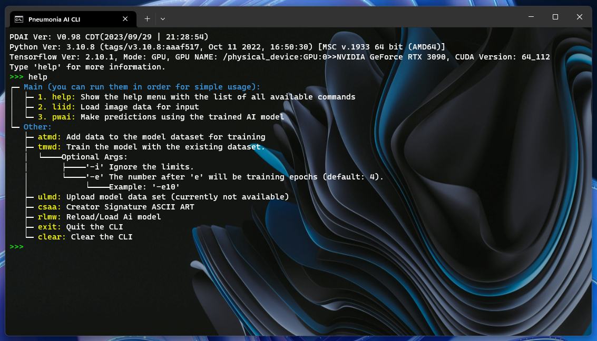

# Python CLI Toolkit


[](https://opensource.org/licenses/MIT)

This Python CLI Toolkit is a powerful tool for creating command-line interfaces (CLI) with Python. It provides a framework for defining commands, handling user input, and managing modules. 

### Example usage:

  

> **Note**\
>  Please note that this image is for a project using the template.

>  **Note**\
>  Please note that this code uses my print_color\
>  for more info go to https://github.com/Aydinhamedi/Python-color-print.

>  **Note**\
>  Please note that there is a template version too\
>  more info on https://github.com/Aydinhamedi/Python-CLI-template

>  **Warning**\
>  Please note that a part of this doc is generated by Ai (GPT-4).

> ### [Usage Documentation](doc.md)

## Features

- Python version check
- Package installation
- Easy command addition and customization
- Colorful CLI interface
- Base commands included
- Error handling

## Getting Started

These instructions will get you a copy of the project up and running on your local machine for development and testing purposes.

### Prerequisites

- Python 3.x

### Installation

1. Clone the repo
   ```sh
   git clone https://github.com/Aydinhamedi/Python-CLI-template
   ```

## Usage

After installation, you can run the CLI application with the `CLI.cmd` and customize the CLI with `Data\CLI_main.py` file. This will start the CLI application where you can use the available commands.

For detailed instructions on how to add commands and customize the CLI, please refer to the [documentation](doc.md).

## License

Distributed under the MIT License. See `LICENSE` for more information.